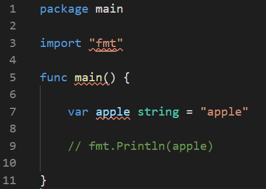
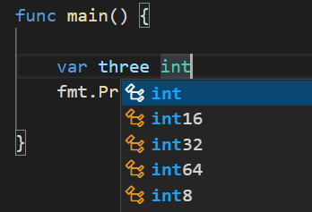
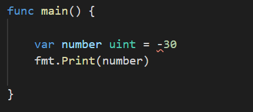
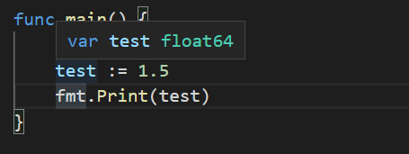

# 2. Variables in Go

### Strings

- variables must be declared with their types

- an error occurs if a variable is **not used** after declaration

  

- declaring an **empty** variable is possible => it will just return nothing but an empty space

  ```go
  func main() {
  
  	var apple string = "apple"
  	var orange string
      fmt.Println(apple, orange)		// returns: apple 
  
  }
  ```

- you can declare variables **without** stating the type using `:=`

  ```go
  func main() {
  
  	lemon := "lemon"
  	fmt.Println(lemon)		// works very well!
  
  }
  ```

- it's possible to reassign a new value to an existing variable

  ```go
  func main() {
  
  	lemon := "lemon"
  	fmt.Println(lemon)
  
  	lemon = "change the variable"
  	fmt.Println(lemon)
  
  }
  // ** return **
  // lemon
  // change the variable
  ```

  

### Integers

- an `int` is basically set to be at least 32 bits in size

- you can specify the bit-size of the integers

  

- `uint` indicates unsigned integers, and no negative numbers are allowed

  

  


### Float

- `float64` has higher precision compared to other float types => un-signing a specific type for a float number will automatically sign the variable as `float64`

  
