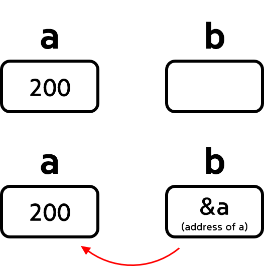
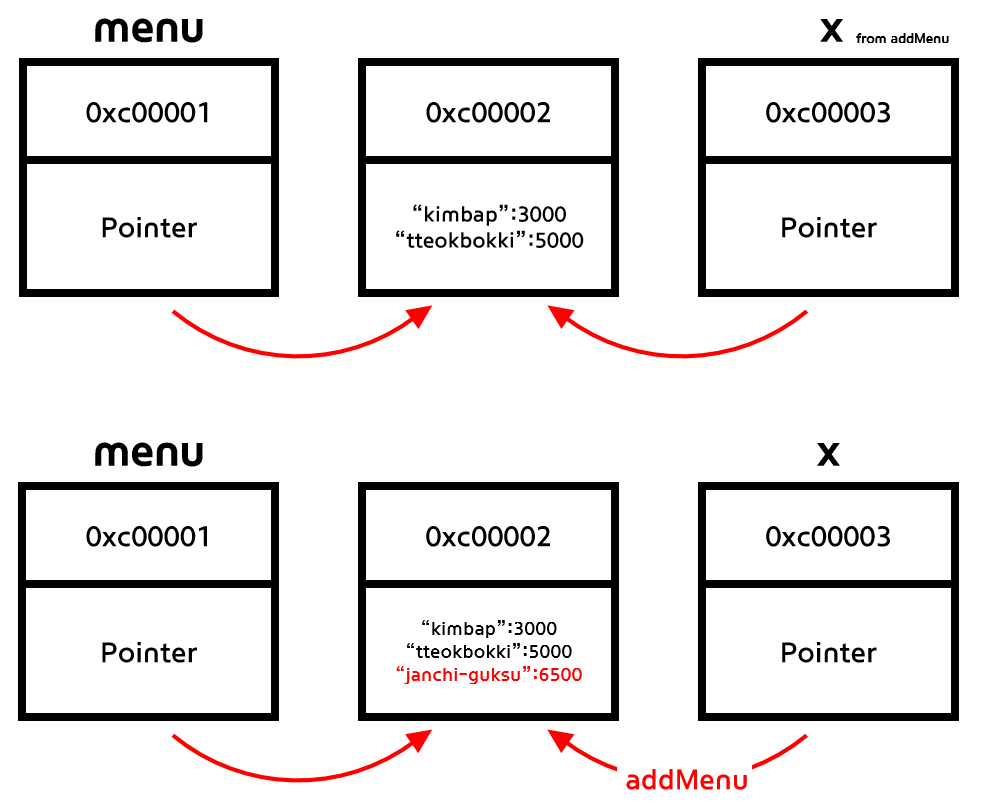

# 10. Pointer

- a pointer is a value that **points to the address** of another value

  

  

## Pointer Values in Go
| Non-Pointer Values                                           | Pointer Wrapper Values                |
| ------------------------------------------------------------ | ------------------------------------- |
| - Strings<br />- Ints<br />- Floats<br />- Booleans<br />- Arrays <br />- Structs | - Slices<br />- Maps<br />- Functions |


### Non-Pointer Values

- Go is a Pass-by-value language
  - Go makes a "copies" of values when passed to non-pointer values

    ```go
    func updateName(x string) {
    	x = "fmgt"
    }
    
    func main() {
    
    	name := "the face shop"
    
    	updateName(name)
    
    	fmt.Println(name)
    }
    // returns "the face shop" => value of "name" was not changed!
    ```

    - the values of `name` and `x` are saved in different memory locations! 

    ```go
    func updateName(x string) {
    	fmt.Println(&x)
    	x = "fmgt"
    }
    
    func main() {
    
    	name := "the face shop"
    	fmt.Println(&name)
    	updateName(name)
    }
    /*
    0xc0000881e0 => &name
    0xc0000881f0 => &x
    */
    ```

    


### Pointer Wrapper Values

- Pointer wrapper values save both **pointer and value**

  ```go
  func addMenu(x map[string]int) {
  	x["janchi-guksu"] = 6500
  }
  
  func main() {
  	menu := map[string]int{
  		"kimbap":     3000,
  		"tteokbokki": 5000,
  	}
  	fmt.Println(menu)
  
  	addMenu(menu)
  	fmt.Println(menu)
  }
  /*
  map[kimbap:3000 tteokbokki:5000]
  map[janchi-guksu:6500 kimbap:3000 tteokbokki:5000] <= map updated!
  */
  ```

  
  
  - both **menu** and parameter **x** keep pointers that point at the value of the map
  - therefore, the **value** can be updated even from another function (ex. addMenu)


### Pointers and Addresses

  - `& (ampersand)` : get the address of a variable
  - `* (asterisk)` : get the original value that the pointer is pointing at

      ```go
      func main() {
        name := "name"
        address := &name
      
        fmt.Printf("address of variable 'name': %v\n", address)
        fmt.Printf("value of that address : %v", *address)
      }
      /*
      address of variable 'name': 0xc0000441f0
      value of that address : name
      */
      ```


