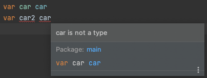

# Struct

- Struct is a short for "structure"
- Struct is a value that is constructed out of other values of different types

```go
struct {
  field1 string
  field2 int
}
```

- You can access the value of a specific field using `.`
  - ex) `myStruct.field1 = 3.14`


## Type

- `Type` allows you to create your own type
  - you can create a **defined type** based on an **underlying type**

```go
type myType struct {
  field1 string
  field2 int
}
```

- Types are usually defined outside of any functions, at package level
  - since writing within a function will limit its scope to that function's block

```go
type car struct {
	name     string
	topSpeed float64
}

func main() {
	var porsche car
	porsche.name = "Porsche 911 R"
	porsche.topSpeed = 323
	fmt.Println("Name:", porsche.name)
	fmt.Println("Top speed:", porsche.topSpeed)
}
```

- Be careful not to name a variable as an existing type's name => the variable will shadow the type




## Modifying a Struct using a function

- Go is a `pass-by-value` language = function parameters receive a **copy** of the arguments the function was called with

  - if the function changes a parameter value, it's changing the copy, not the original

  ```go
  func main() {
  	amount := 6
  	double(amount)			// pass a copy of amount
  	fmt.Println(amount) // prints the original value
  }
  
  func double(number int) {
  	number *= 2					// alters the copied value
  }
  ```

  ```bash
  6
  ```


## Accesing struct fields through a pointer

- You have to pass the `pointer(&)` of a value as an argument
- The function should receive a `value-at pointer(*)` as a parameter to access the value of the received pointer

```go
func main() {
	amount := 6
  double(&amount)			// pass the pointer(address) of amount
	fmt.Println(amount)
}

func double(number *int) { // receive a value-at pointer as a function parameter
	*number *= 2					// alters the value of the received pointer
}
```

- It's often a good idea to pass functions a **pointer** to a struct, rather than the struct itself
  - passing just a struct will make the computer create a copy of a struct, then pass the copied struct
  - this can take up a lot of memory
  - when passing a pointer, only one copy of the original struct exsits in memory


## Exporting types and structs

- A type must be capitalized to be exported
- A struct's field must be capitalized to be exported


## Anonymous struct fields

- Go allows to define anonymous fields
- Struct fields may not have names, but just types

```go
type car struct {
	name     string
	topSpeed float64
	detail   // anonymous field & embedded struct
}

type detail struct {
	color 	 string
	height	 float64
	width 	 float64
}
```

- A struct used as an anonymous field is called an `embedded struct`