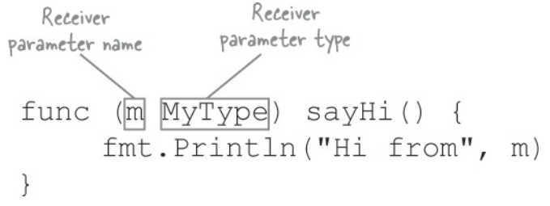
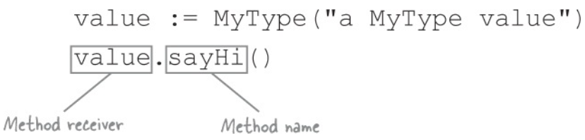

# Defined Types

- Once a variable of a defined type is announced, you cannot assign a value of a different defined type
  - if the other type has the same underlying type, you can convert from one to another
- A defined type supports all the same operations as its underlying type


## Method definition



- `Receiver parameter` indicates the type which this method will be available for



- a defined method with a receiver parameter only works for the specied receiver type

> Go does not support overloading(multiple functions with same name). BUT you can have multiple **methods** with same names unless they are for different types

### Pointer receiver parameters

```go
func main() {
	number := Number(4)
	fmt.Println("Original value of number:", number)

	number.Double() // no need to pass value
	fmt.Println("Updated value of number:", number)
}

type Number int

func (n *Number) Double() {
	*n *= 2
}
```

- When you call a method that requires a pointer receiver on a variable with a nonpointer type, Go will automatically convert the receiver to a pointer for you